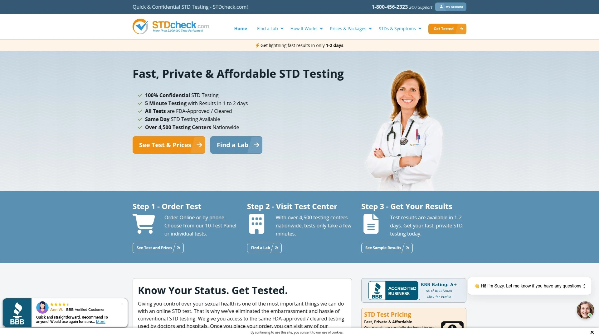
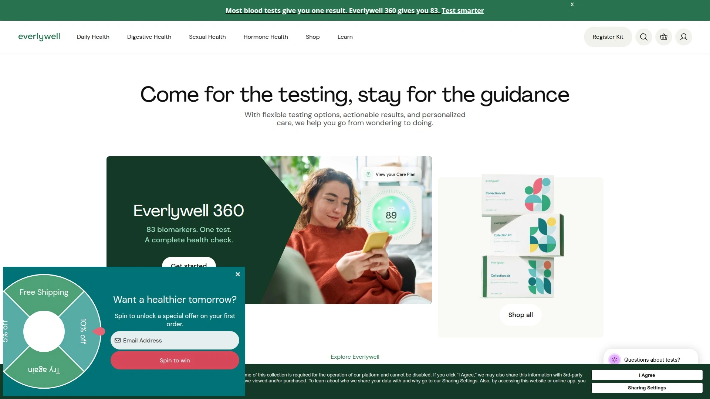
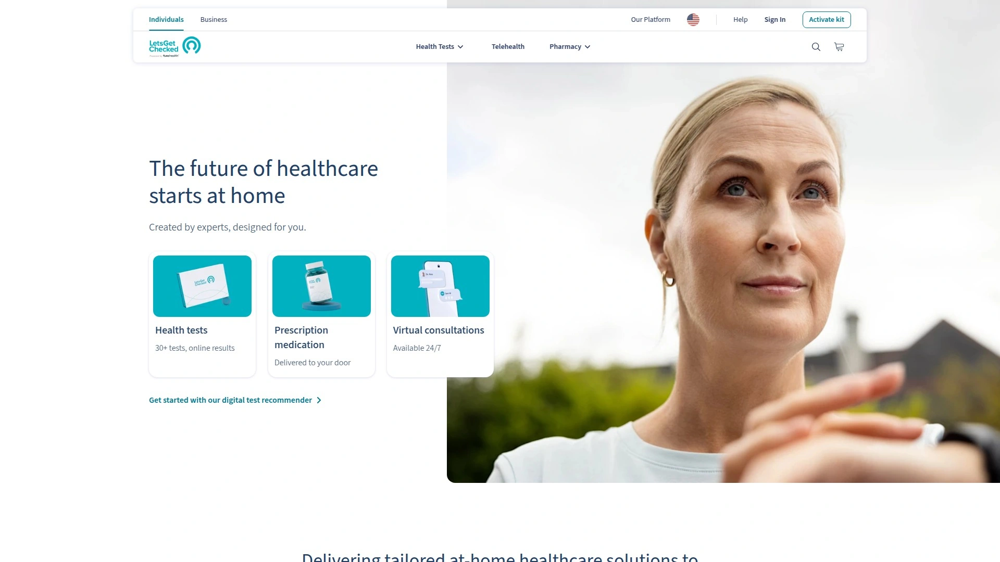
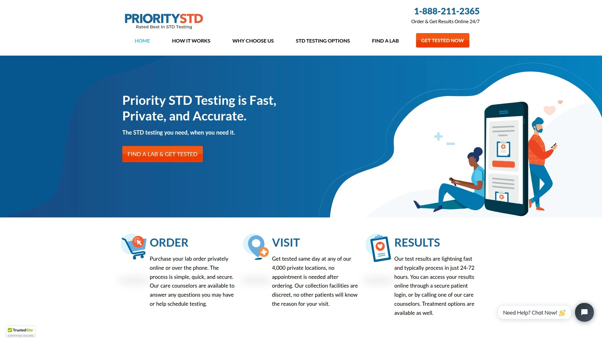
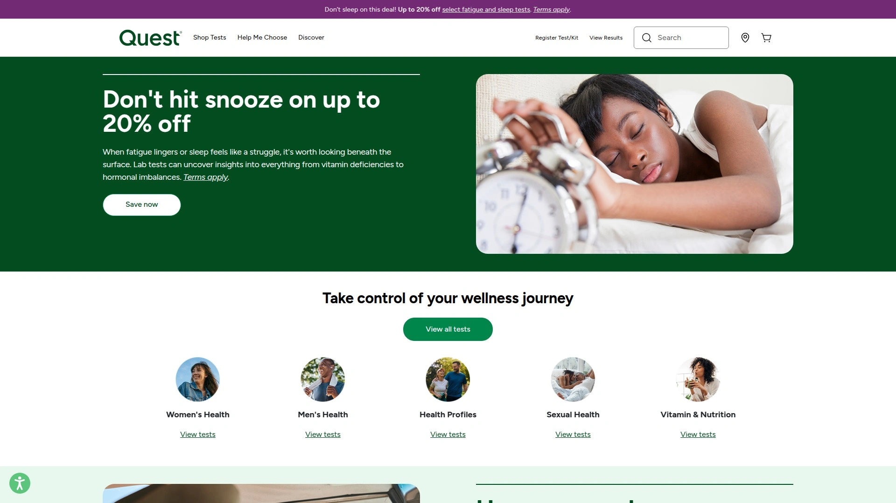
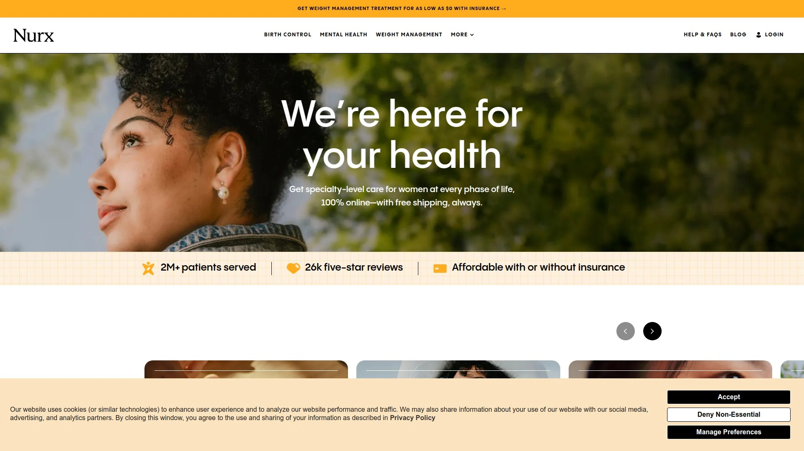

# Top 7 Confidential STD Testing Services Ranked in 2025 (Latest Update)

Walking into a clinic for STD testing means potentially running into someone you know, explaining why you're there to front desk staff, and hoping your insurance company doesn't flag test results on your permanent medical record. Traditional testing creates privacy nightmares where something deeply personal becomes surprisingly public through insurance claims, employer notifications via shared health plans, or awkward waiting room encounters. Confidential STD testing services eliminate these concerns by offering discreet online ordering, private lab visits without appointments or questions, fast results delivered securely online, and zero insurance reporting keeping everything off permanent records. Whether you're managing routine sexual health or dealing with exposure concerns, these platforms prioritize your privacy while delivering FDA-approved testing through CLIA-certified labs—giving you accurate answers without broadcasting your personal health decisions.

## **[STDCheck](https://www.stdcheck.com)**

Same-day private testing at 4,500+ locations with 1-2 day results and zero insurance reporting.

STDCheck operates the largest network of confidential testing centers in the United States, providing access to 4,500+ lab locations where you can get tested the same day you order without scheduling appointments. The process starts online where you select individual tests or comprehensive panels, then receive a lab authorization that lets you walk into any participating location and complete testing within minutes. No paperwork, no questions asked, no awkward conversations—just provide your samples and leave.

Results arrive within 1-2 days through secure online portal access, among the fastest turnaround times available. This speed matters when anxiety about potential exposure makes every day feel like a week. Text message status updates keep you informed about processing without requiring constant portal checking. When results come back, you see clear positive or negative indicators with straightforward explanations about what findings mean for your health.

The 10-Test Panel represents the most comprehensive STD screening available, testing for HIV types 1 and 2, hepatitis A, hepatitis B, hepatitis C, herpes type 1, herpes type 2, syphilis, chlamydia, gonorrhea, and trichomoniasis. STDCheck stands alone in including hepatitis A testing in standard panels, providing coverage other services omit. Individual test options let you target specific concerns without paying for comprehensive panels when you know exactly what exposure risks exist.

Zero insurance involvement protects your privacy completely. STDCheck doesn't bill insurance companies, meaning test results never appear on your permanent medical records or generate explanation of benefits mailings that family members or employers might see through shared health plans. This anonymity matters profoundly for people on family plans, those with judgmental relatives, or anyone valuing medical privacy. You pay directly, receive itemized receipts for personal records, and maintain complete control over who knows about your testing.

Physician consultation comes included when positive results require treatment. Licensed doctors review your results, prescribe appropriate medications, or provide specialist referrals for conditions requiring advanced care. This medical support ensures you don't just receive test results but also get guidance about next steps, treatment options, and partner notification strategies. The Care Advisors answer questions throughout the process, providing reassurance and practical information when you're navigating unfamiliar territory.

Pricing starts at $24 for individual tests, with the comprehensive 10-Test Panel priced at $249. The cost transparency eliminates surprise fees—what you see online is what you pay, with no hidden laboratory charges or processing fees appearing later. For people without insurance coverage for STD testing or those deliberately avoiding insurance-based testing to protect privacy, the direct pricing provides budget clarity upfront.

## **[myLAB Box](https://www.mylabbox.com)**

At-home collection kits with free physician consults and 2-5 day results testing for 14 different STIs.

myLAB Box pioneered the at-home STD testing model, delivering complete test kits to your door that let you collect samples in complete privacy without visiting labs or clinics. The kits contain everything needed—collection swabs, urine collection cups, lancets for blood samples, detailed instructions, specimen bags, and prepaid return envelopes. Sample collection takes 10-15 minutes in your bathroom, then you mail specimens back using the included prepaid envelope.

The variety of testing options accommodates different needs and budgets. The Safe Box ($169) covers the four most common STIs—chlamydia, gonorrhea, trichomoniasis, and HIV types 1 and 2. The Uber Box ($199) expands to eight infections adding hepatitis C, herpes type 2, and syphilis. The Total Box ($369-$399) represents the most comprehensive at-home testing available, screening for 14 different STIs including optional HPV testing for people over 30. Individual test options let you target specific concerns without comprehensive panel pricing.

Free physician telemedicine consultations come included automatically when results show positive findings. You're not just receiving lab results and figuring out next steps alone—board-certified doctors review findings with you, explain what infections mean, prescribe appropriate treatments when oral medications suffice, and provide specialist referrals for conditions requiring in-person care. This medical support transforms results from scary numbers into actionable health plans.

Results arrive within 2-5 days after the lab receives your samples. The timing depends on shipping speed and processing workload, but generally you receive answers within a week of mailing specimens. Secure online portal access protects your information through password protection and encryption. The portal displays results clearly with explanations about what each finding means rather than just positive/negative designations requiring Google searches to understand.

The V-Box ($189) specifically addresses vaginal health beyond just STIs, testing for bacterial vaginosis and yeast infections alongside trichomoniasis, chlamydia, and gonorrhea. This comprehensive vaginal screening helps identify the actual cause of symptoms like unusual discharge or irritation, which could stem from STIs or other common infections requiring different treatments. The targeted approach saves women from guessing about symptom causes or trying multiple treatments hoping something works.

The Love Box ($378) provides couple's testing with complete 8-panel screens for both partners. The coordinated testing helps couples verify clean health status together when starting new relationships or provides peace of mind for committed couples wanting baseline sexual health confirmation. Testing together removes awkwardness about one partner getting checked while the other avoids it.

## **[Everlywell](https://www.everlywell.com)**

Subscription-based at-home testing with gender-specific panels and quarterly testing options saving long-term costs.

Everlywell differentiates through subscription models making regular testing affordable for sexually active people who should be screening quarterly or semi-annually. The one-time test purchases work like competitors, but subscription plans reduce per-test costs significantly. Quarterly subscriptions deliver new test kits every three months ensuring you maintain regular screening schedules the CDC recommends for people with multiple partners or new partners.

The Men's Sexual Health Test and Women's Sexual Health Test provide gender-optimized screening designed around the STIs most relevant to each sex and the sample collection methods that work best. Women's tests use vaginal swabs and urine samples to check for chlamydia, gonorrhea, trichomoniasis, hepatitis C, HIV, and syphilis. Men's tests use urine samples testing for chlamydia, gonorrhea, trichomoniasis, hepatitis C, HIV, and syphilis. The gender-specific approach streamlines sample collection compared to universal kits requiring multiple sample types some people find uncomfortable.

Physician-reviewed results come standard, with board-certified physicians analyzing findings and providing follow-up guidance through secure messaging. When results indicate infections, the medical team explains treatment options, prescribes medications when appropriate, or facilitates referrals to local providers for in-person care. The integrated medical support ensures testing leads to actual health outcomes rather than just information without action plans.

Test kit quality receives FDA oversight with tests that are either FDA-approved or FDA-cleared, providing regulatory confidence in accuracy. The CLIA-certified partner laboratories meet the same standards doctors and hospitals use, ensuring results are clinically valid rather than questionable screening from uncertified facilities. This quality assurance matters when making health decisions based on test findings.

Results typically arrive within a few days after the lab receives samples, though exact timing varies based on processing volume and shipping speeds. The online dashboard presents findings clearly with educational resources explaining what different STIs are, how they transmit, what symptoms might appear, and what treatment involves. The educational component helps people understand their sexual health broadly rather than just learning about specific test results.

Pricing starts at $49 for single tests with subscriptions reducing costs through volume discounts. The subscription model particularly suits people in dating phases meeting new partners frequently, people in non-monogamous relationships with multiple partners, or anyone prioritizing proactive sexual health management through regular screening intervals rather than reactive testing only when problems arise.

## **[LetsGetChecked](https://www.letsgetchecked.com)**

Comprehensive at-home testing with 30% discount codes and extensive follow-up support from medical professionals.

LetsGetChecked provides what many consider the most thorough at-home STD testing experience, combining comprehensive test panels with exceptional post-results support from medical professionals. The testing process mirrors competitors—order online, receive kits at home, collect samples privately, mail back using prepaid envelopes, receive results through secure online portals. Where LetsGetChecked distinguishes itself is the depth of medical follow-up available after results arrive.

In-depth consultation opportunities with nurses and doctors help you understand results fully and develop action plans. These aren't rushed 5-minute calls—you can have genuine conversations about what infections mean, treatment options, partner notification strategies, and prevention approaches for future sexual activity. The extended support proves invaluable when dealing with positive results that feel overwhelming without medical guidance.

Bundled test offerings simplify choosing appropriate screenings without researching which individual tests you need. The bundles group tests logically based on comprehensive screening needs, common symptom patterns, or specific exposure types. This curation helps people unfamiliar with sexual health navigate testing options without becoming armchair epidemiologists researching every STI independently.

The testing quality meets the same FDA and CLIA certification standards as competitors, ensuring accurate, clinically valid results you can trust when making health decisions. Collection procedures are straightforward with detailed instructions and customer support available if you have questions about proper sample collection techniques.

Pricing sits in the mid-to-upper range compared to competitors, but discount codes like FINVSFIN30 reduce costs by 30%, bringing prices down to competitive levels. The company regularly offers promotional pricing making comprehensive panels more accessible. For people prioritizing extensive medical support over lowest possible prices, the investment in LetsGetChecked's thorough follow-up care delivers value beyond just test results.

Results timing aligns with industry standards—samples processed within days of receipt with findings available through encrypted online portals. Notification systems alert you when results are ready rather than requiring daily portal checking during the anxious waiting period. The secure messaging system lets you ask follow-up questions to medical professionals directly through the platform.

## **[PrioritySTD Testing](https://www.prioritystdtesting.com)**

Rated #1 for same-day lab testing with 2-3 day results and treatment prescription capabilities at 4,000+ locations.

PrioritySTD Testing emphasizes speed and convenience through the largest network of same-day testing centers after STDCheck. The 4,000+ lab locations accept walk-ins throughout business hours, meaning you can decide you want testing this morning and be completing it by this afternoon. This immediacy helps when exposure concerns create anxiety that makes waiting days or weeks for scheduled appointments unbearable.

Treatment prescription capabilities built into the service mean positive results can lead directly to prescribed medications without requiring separate doctor visits. The medical team reviews results, writes prescriptions for treatable infections, and sends them to pharmacies near you for pickup. This integrated approach compresses the time between discovering infections and starting treatment, reducing the window where infections can cause health complications or get transmitted to partners unknowingly.

Individual test pricing starts at $24 with comprehensive panels ranging up to $299 depending on how many infections you're screening for. The tiered panel options let you balance thoroughness against budget constraints—basic panels cover the most common STIs while expanded panels add less common infections for truly comprehensive screening. The pricing transparency shows all costs upfront without surprise fees appearing at checkout or billing later.

The 10-panel comprehensive screening tests for chlamydia, gonorrhea, hepatitis B, hepatitis C, herpes type 1, herpes type 2, HIV types 1 and 2, syphilis, and trichomoniasis. This breadth covers the vast majority of sexual health screening needs for most people, catching infections that might otherwise go undetected for months or years causing progressive health damage or unknowing transmission.

Results arrive within 2-3 days after lab visits, slightly longer than STDCheck's 1-2 day turnaround but still fast relative to traditional doctor-ordered testing that can take a week or more. Secure online portal access protects your information with encryption and password protection. Email and text alerts notify you when results are ready without revealing any sensitive information in the notifications themselves.

Privacy protections match competitors—zero insurance billing, no permanent medical record entries, completely confidential results delivered only to you through secure channels. The testing centers operate discreetly without large signs advertising STD testing services, providing anonymity even when visiting physical locations. Locations inside existing medical lab facilities blend STD testing with routine bloodwork and other medical testing, preventing anyone from knowing why you're there.

## **[Quest Diagnostics](https://www.questhealth.com)**

National laboratory network offering doctor-quality STD testing with 2-5 day results and optional insurance billing.

Quest Diagnostics brings the credibility of America's largest clinical laboratory network to direct-access STD testing. These are the same laboratories doctors use when ordering tests, ensuring results meet the highest clinical standards. The Quest Health consumer service lets you order tests online without doctor referrals, visit Quest patient service centers for sample collection, and receive results through secure online portals.

The testing process works similarly to other lab-based services—order online, receive a lab authorization, visit any of thousands of Quest locations nationwide, provide samples, and wait for results. Quest's massive laboratory infrastructure means locations exist in virtually every city and many suburban areas, providing convenient access without long drives to specialized STD testing centers.

Insurance acceptance distinguishes Quest from privacy-focused competitors. You can choose to bill insurance if you have coverage for preventive sexual health screening, potentially reducing out-of-pocket costs to copay levels. Alternatively, you can pay directly without involving insurance to maintain complete privacy. This flexibility accommodates people wanting to use insurance benefits and those prioritizing anonymity over cost savings.

Results typically process within 2-5 days depending on test complexity and laboratory workload. The online portal presents findings with reference ranges and basic interpretations. Quest provides doctor-quality result reports that physicians can review if you choose to share findings with your primary care provider for integrated health management.

The full-panel STD screening tests for seven common infections including chlamydia, gonorrhea, hepatitis B, hepatitis C, HIV types 1 and 2, and syphilis. Individual test options let you target specific concerns or add specialized testing beyond the standard panel. Pricing varies based on test selection but generally aligns with industry averages for lab-based testing.

The established reputation of Quest Diagnostics provides confidence for people concerned about testing accuracy or laboratory legitimacy. These aren't startup labs with limited track records—Quest has processed billions of tests over decades with established quality control procedures and regulatory compliance. This institutional reliability appeals to people who want absolute confidence in result accuracy when making health decisions.

## **[Nurx](https://www.nurx.com)**

Telehealth-integrated at-home testing with insurance coverage and prescription treatment included in 7-day turnaround.

Nurx combines at-home STD testing with comprehensive telehealth services, providing an integrated sexual health management platform. The service accepts many insurance plans for test coverage, potentially eliminating out-of-pocket costs for people with qualifying benefits. For those without coverage or preferring to avoid insurance, self-pay pricing remains competitive with other at-home testing services.

The Full Control Home STI Test Kit screens for chlamydia, gonorrhea, syphilis, and hepatitis C through samples you collect at home. The 7-day result turnaround from sample arrival at the lab is slightly longer than some competitors but still faster than traditional doctor-ordered testing. The Nurx medical team reviews all results and reaches out regardless of findings—positive or negative—ensuring you understand what results mean for your health.

Treatment prescription comes included automatically with positive results. The medical team prescribes oral medications when appropriate, sending prescriptions to pharmacies you designate for convenient pickup. For infections requiring injectable treatments or specialized care, they facilitate referrals to local providers. This treatment integration removes barriers between discovering infections and starting therapy that can delay care for days or weeks with traditional testing approaches.

The medical provider team reviews your health history during the ordering process, helping ensure you select appropriate test kits for your specific situation. This personalized guidance helps people unfamiliar with STD testing navigate which tests make sense based on sexual activity patterns, symptom presence, and known exposure risks. The consultation eliminates guesswork about whether you're ordering the right tests.

Sample collection takes approximately 15 minutes with detailed instructions included in test kits. The prepaid return envelope simplifies mailing specimens back to the laboratory. The Nurx app provides mobile access to your account, allowing you to manage testing, view results, communicate with the medical team, and track prescription status from your phone.

Follow-up testing recommendations based on CDC guidelines help you maintain appropriate screening schedules. Depending on sexual activity levels and partner numbers, Nurx suggests retesting intervals between 3-12 months, helping you stay current with sexual health monitoring rather than testing once and assuming you're perpetually clear despite ongoing exposure risks.

## FAQ

**How confidential is online STD testing compared to visiting my regular doctor?**

Online STD testing services like STDCheck and myLAB Box provide significantly more privacy than doctor visits because they don't bill insurance companies or create permanent medical records. When your doctor orders STD tests through insurance, explanation of benefits statements get mailed to your address, claims appear in insurance portals visible to policyholders (potentially parents or spouses on family plans), and results enter your medical record affecting future insurance applications. Confidential testing services operate completely outside this system—you pay directly, results go only to you through encrypted portals, and no third parties receive any information about your testing. The downside is you pay full price rather than insurance-covered copays, but the privacy protection is absolute.

**Can at-home STD test kits be as accurate as tests done in doctor's offices?**

Yes, at-home test kits from reputable services like Everlywell, myLAB Box, and LetsGetChecked use the same FDA-approved/cleared testing methods and CLIA-certified laboratories that doctors use when ordering tests. The difference is who collects the sample—you at home versus a phlebotomist at a clinic—but the actual laboratory analysis is identical. Studies show at-home collection yields accurate results when you follow instructions properly, particularly for urine samples and vaginal swabs which are straightforward to collect. Blood samples via finger-prick require slightly more care, but included instructions guide you through the process. The key is choosing services using certified laboratories rather than unknown facilities lacking quality oversight.

**What happens if my STD test comes back positive?**

Legitimate testing services include medical support when positive results occur. Services like STDCheck and PrioritySTD provide physician consultations where doctors review findings, prescribe appropriate medications for treatable infections like chlamydia or gonorrhea, and facilitate specialist referrals for conditions requiring specialized care like HIV or hepatitis. At-home testing companies like myLAB Box and LetsGetChecked include free telemedicine consultations walking you through treatment options. Most bacterial STIs require simple oral antibiotic courses you can fill at any pharmacy. The medical team also provides guidance about partner notification strategies and prevention approaches moving forward. Positive results feel scary, but modern treatments cure most bacterial STIs completely, and effective management exists for viral infections.

## Conclusion

Traditional STD testing through doctors creates privacy nightmares where insurance claims notify family members, permanent medical records affect future coverage, and waiting room encounters risk embarrassing social situations that make people avoid testing altogether despite legitimate health concerns. Confidential testing services eliminate these barriers through direct payment avoiding insurance, secure online results protecting privacy completely, and discreet lab visits or at-home collection removing public exposure entirely. [STDCheck](https://www.stdcheck.com) specifically excels for people prioritizing speed and convenience—same-day testing at 4,500+ locations nationwide, 1-2 day results faster than competitors, comprehensive 10-panel screening including hepatitis A coverage others lack, and zero insurance reporting keeping everything off permanent records, making it ideal for anyone wanting fast, private STD testing without privacy compromises traditional medical systems impose.
